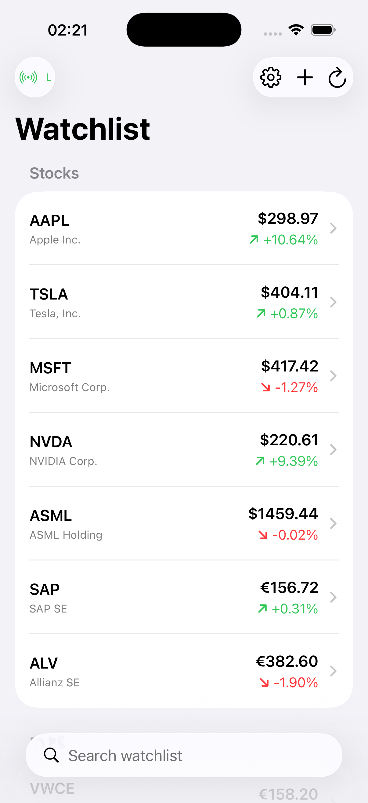
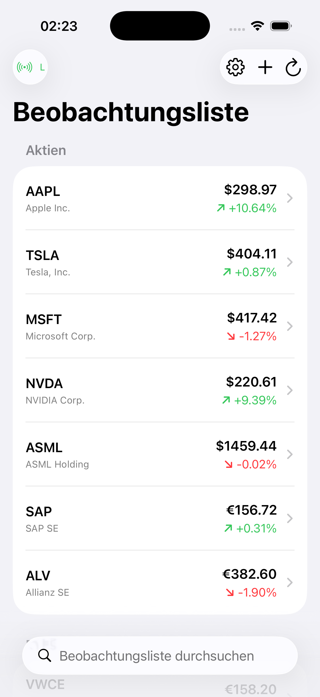
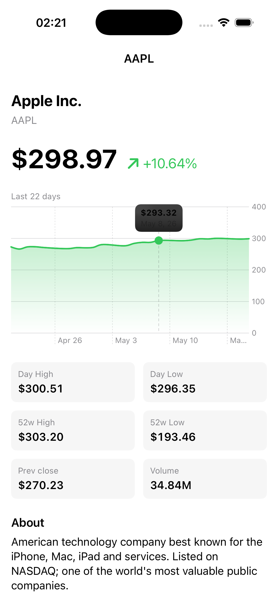
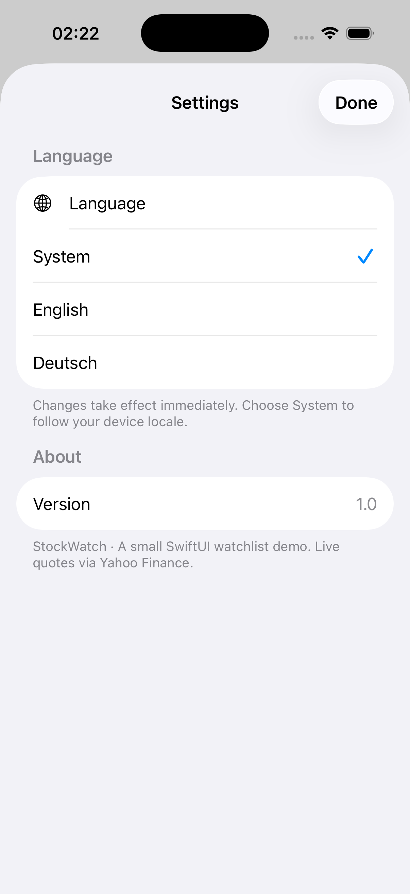
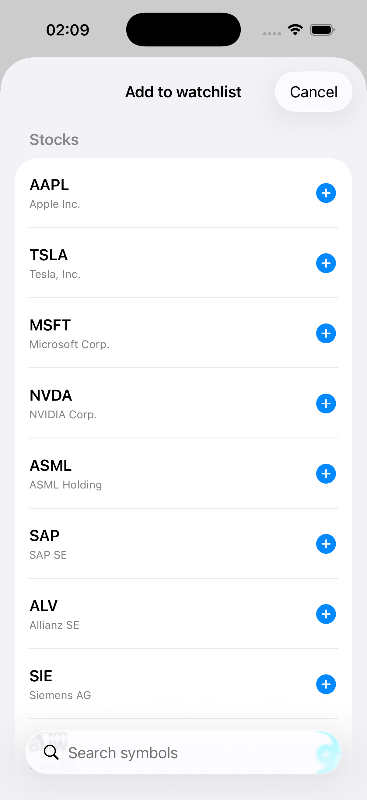

# StockWatch

A small SwiftUI watchlist app built as a learning project while transitioning
from C# / Unity to iOS. Inspired by the broker UIs of platforms like
Scalable Capital — wired to live market data, editable, persisted, localized
in English + German with an in-app language switch, and featuring a
Google-Finance-style interactive chart.

> *"It's small on purpose. Two days, real Swift, real architecture, and I can
> defend every line."*

## Screenshots

| Watchlist (EN) | Watchlist (DE) | Interactive chart | Settings | Add |
|---|---|---|---|---|
|  |  |  |  |  |

## What it does

- **Editable watchlist** of stocks and ETFs. Swipe a row to remove. Tap **+**
  to pick more from the catalogue. The watchlist persists across launches.
- **Live quotes** fetched from a free, unauthenticated Yahoo Finance
  endpoint on launch, on pull-to-refresh, and via the refresh button.
- **Sectioned** by category — **Stocks** and **ETFs** — including popular
  picks on Scalable Broker (VWCE, EUNL, SXR8, IS3N).
- **Search bar** filters the watchlist in real time.
- **Interactive Swift Charts chart** on the detail screen — touch (or
  long-press and drag) anywhere on the line to inspect the exact closing
  price and date for that day, with a dashed indicator line, an animated
  point, and a floating value bubble.
- **Detail screen** with current price, percent change, smoothed line +
  area chart of the last ~22 trading days, day high/low, 52-week high/low,
  previous close, volume, and a short company description.
- **In-app language switcher** — open Settings (gear icon) and pick
  **System**, **English**, or **Deutsch**. Switches the entire UI
  instantly, no restart required.
- **Last-updated timestamp** at the foot of the list.
- **Status badge** in the nav bar — Loading / Live / N failed / Offline.
- **Graceful offline mode** — if the network call fails, the row falls
  back to a hardcoded "last known" price and the badge says "Offline".
- **App icon** — custom 1024×1024 navy/teal gradient with an ascending
  white chart line and a green accent point at the apex.

## Architecture

- **SwiftUI** for the UI layer.
- **MVVM** — `WatchlistViewModel` (`@MainActor @Observable`) owns state.
  Views are thin.
- **`StockService` protocol** with two implementations:
  - `YahooStockService` — real `URLSession` + `Codable` against
    `query2.finance.yahoo.com/v8/finance/chart/{symbol}`, with a fallback
    to `query1.finance.yahoo.com` on transient failures. Parses
    timestamps into real `Date` values so the chart's X axis shows real
    trading days.
  - `MockStockService` — deterministic fake data for tests and previews.
- **`WatchlistStore`** — small persistence layer with closure-based
  `load` / `save`. Production uses `UserDefaults`; tests inject an
  ephemeral in-memory store.
- **`LanguageManager`** — installs a `Bundle` subclass onto `Bundle.main`
  via `object_setClass`, allowing `localizedString(forKey:)` to consult an
  override `.lproj` bundle. Combined with `.id(lang)` on the root view,
  switching language refreshes every `Text("…")` and `String(localized:)`
  at runtime — no app restart needed.
- **Dependency injection through the initialiser** — both the watchlist
  view model and the detail view take their service via init.
- **Sequential fetch with a 250 ms stagger** — Yahoo's public endpoint
  rate-limits parallel bursts (HTTP 429), so the symbols are fetched one
  after another.
- **Tolerates partial failure** — each symbol's fetch is independent;
  failures show the fallback price rather than blocking the list.
- **Swift Charts** (iOS 16+) with `LineMark` + `AreaMark` interpolated
  with Catmull-Rom, plus `RuleMark` + `PointMark` driven by
  `chartXSelection` for the interactive scrubbing.
- **`Localizable.xcstrings`** String Catalog with full English + German
  translations.
- **XCTest** — 11 tests covering persistence, add/remove, duplicates,
  unknowns, category filtering, fallback behaviour, refresh transitions,
  mock-service injection, and percent-change math.

### Accessibility

Color is never the only carrier of meaning:

- Each row pairs the red/green percent change with an SF Symbol arrow
  (`arrow.up.right` / `arrow.down.right`).
- Each row exposes a combined `accessibilityLabel`
  (`"AAPL, Apple Inc., $298.97, up 10.64 percent"`).
- All toolbar buttons have `accessibilityLabel` + `accessibilityHint`.
- The status badge announces its current state to VoiceOver.
- The decorative offline-fallback bar chart is `accessibilityHidden(true)`.
- The interactive chart exposes its purpose as an accessibility label.

## Project layout

```
StockWatch/
├── StockWatchApp.swift           – @main entry + screenshot conditional compile
├── ContentView.swift             – Watchlist (sections, search, swipe-delete, status badge)
├── AddStockView.swift            – Sheet for adding a symbol from the catalog
├── SettingsView.swift            – Language picker + about
├── StockRowView.swift            – Row cell (currency-aware, accessible)
├── StockDetailView.swift         – Detail with interactive Swift Charts + metrics
├── WatchlistViewModel.swift      – @MainActor @Observable view model (MVVM)
├── WatchlistStore.swift          – UserDefaults persistence (with ephemeral test variant)
├── StockService.swift            – Protocol + Yahoo impl + Mock impl
├── StockQuote.swift              – Value-type quote model (incl. historicalDates)
├── Stock.swift                   – Static stock info + AssetCategory
├── MockData.swift                – 14-symbol catalog + default watchlist
├── LanguageManager.swift         – Bundle swizzle for runtime language switch
├── Localizable.xcstrings         – English + German strings
└── Assets.xcassets/
    ├── AppIcon.appiconset/       – 1024×1024 icon
    └── AccentColor.colorset/     – brand accent

StockWatchTests/
└── WatchlistViewModelTests.swift  – 11 XCTest cases
```

## Build

The Xcode project is generated by [XcodeGen](https://github.com/yonaskolb/XcodeGen)
from `project.yml`.

```bash
xcodegen generate
open StockWatch.xcodeproj
```

Build & test from the command line:

```bash
xcodebuild -scheme StockWatch \
  -destination 'platform=iOS Simulator,name=iPhone 17 Pro' \
  test
```

**Requirements:** Xcode 15+, iOS 17+, Swift 5.10.

## What I'd do with another day

- Real-time tick updates via a WebSocket provider (Tiingo, Polygon).
- Add caching so repeat detail visits don't re-hit the network.
- Drag to reorder rows (already wired in the view model).
- A "portfolio" mode — enter shares held, compute P&L.
- Snapshot tests for the row and detail views.
- Dynamic Type compliance on the big price label.
- Wider locale support (French, Spanish, Italian).
- Add notifications for price thresholds.

## Why I built it

I'm transitioning from C# / Unity to iOS, ramping fast for a Junior iOS
Engineer interview. This project let me practice SwiftUI, navigation,
`@Observable` state, protocol-based DI, `async/await` networking,
`Codable`, interactive Swift Charts, `UserDefaults` persistence, runtime
localization via bundle swizzling, accessibility, asset catalogs, and
XCTest in a fintech-relevant context.

## Tech

Swift · SwiftUI · Swift Charts · `chartXSelection` · `async/await` · `URLSession` · `Codable` · `UserDefaults` · String Catalog · Bundle swizzle · XcodeGen · XCTest · Xcode 15+ · iOS 17+

## Licence

MIT — see [LICENSE](LICENSE).
