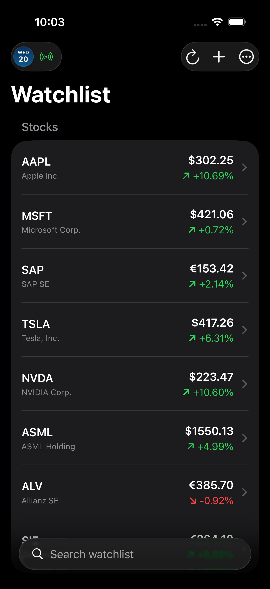
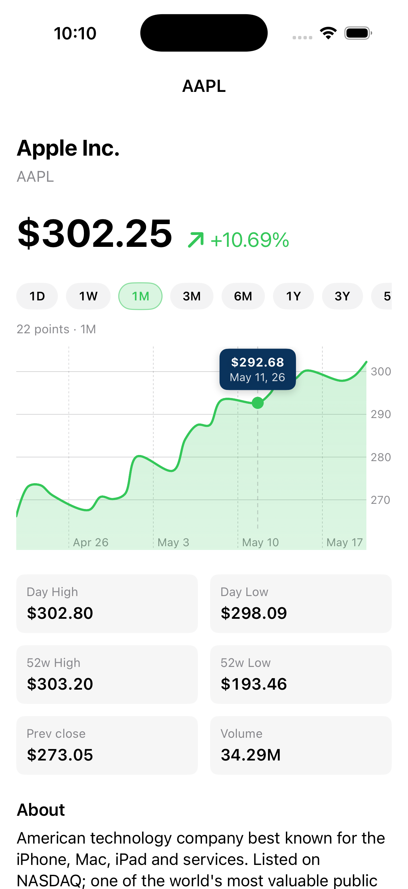
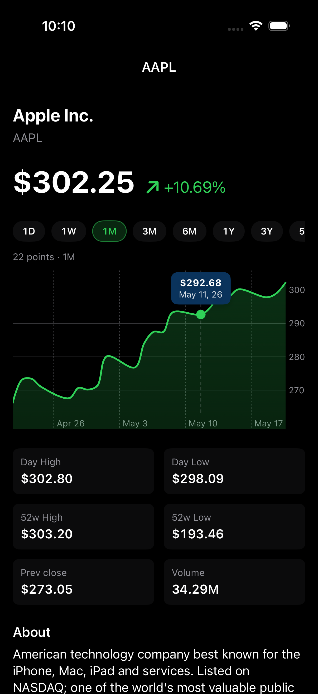

# StockWatch

A small SwiftUI watchlist app inspired by the broker UIs of platforms like
Scalable Capital. Live market data, editable + persisted watchlist with
list **and** grid layouts, an interactive Swift Charts chart with seven
time ranges including 5-year history, symbol-relevant news that opens
in-app, English + German with a runtime language switch, and full
**Dark / Light / System** theming.

> *"It's small on purpose. Real Swift, real architecture, and I can defend
> every line."*

## Screenshots

### Light & dark theming

| Watchlist · Light | Watchlist · Dark |
|---|---|
|  |  |

### Detail screen — interactive chart, range chips, finger-scrubbing

| Detail · Light | Detail · Dark |
|---|---|
|  |  |

### Earlier screens (v1–v5 reference)

| Watchlist (EN) | Watchlist (DE) | Interactive chart | Settings | Add |
|---|---|---|---|---|
|  |  |  |  |  |

## What it does

- **Editable watchlist** of 55+ stocks and ETFs across US, German Xetra,
  UK, Swiss and Danish exchanges. Swipe a row to remove, tap **+** to
  pick more from the catalogue, search-filter in real time. Persists
  across launches.
- **Live quotes** fetched from Yahoo Finance on launch, on pull-to-refresh,
  and via a one-tap refresh button in the toolbar.
- **Two layouts** — classic **List** or a 2-column **Grid** of cube cards
  with mini Swift Charts sparklines, each clipped to its rounded
  rectangle. Layout choice is persisted.
- **Two ways to reorder** — long-press any row to lift and drop
  (`.draggable` + `.dropDestination`), or tap **Edit watchlist** from
  the ⋯ menu to use drag handles. Exit Edit mode either by tapping the
  prominent blue checkmark that replaces ⋯, or by tapping the empty
  area below the list.
- **Interactive detail chart** built on Swift Charts. Touch (or long-press
  and drag) anywhere on the line to inspect the exact closing price and
  date — dashed indicator, animated point, floating value bubble.
- **Eight time-range chips** above the chart: **1D / 1W / 1M / 3M /
  6M / 1Y / 3Y / 5Y**. Each tap re-queries Yahoo with the matching
  `range` and `interval` and the chart redraws.
- **Multi-stop fade gradient** under the line that mimics Apple Stocks —
  hugs the line at the top, fades to fully transparent at the bottom,
  hard-clipped to the chart frame.
- **Live news per stock**, fetched from Yahoo's symbol-filtered
  search-news JSON (`relatedTickers` filter) with a Google News RSS
  fallback. Tap any headline to read the full article in-app via
  `SFSafariViewController`.
- **In-app language switcher** — open Settings and pick **System**,
  **English**, or **Deutsch**. Switches the entire UI instantly, no
  restart.
- **Theme picker** — **Default** (follows iPhone), **Light**, or **Dark**.
  Persisted across launches.
- **Last-updated timestamp** at the foot of the list, status badge in
  the nav bar (Loading / Live / N failed / Offline).
- **Graceful offline mode** — fallback prices kick in on network failure
  and the badge says "Offline".
- **Custom app icon** — 1024×1024 navy/teal gradient with an ascending
  chart line.

## Architecture

- **SwiftUI** for the UI layer.
- **MVVM** — `WatchlistViewModel` (`@MainActor @Observable`) owns state.
  Views are thin.
- **`StockService` protocol** with two implementations:
  - `YahooStockService` — real `URLSession` + `Codable` against
    `query2.finance.yahoo.com/v8/finance/chart/{symbol}`, with a fallback
    to `query1.finance.yahoo.com` on transient failures. Parses
    timestamps into real `Date` values so the chart's X axis shows real
    trading days.
  - `MockStockService` — deterministic fake data for tests and previews.
- **`WatchlistStore`** — small persistence layer with closure-based
  `load` / `save`. Production uses `UserDefaults`; tests inject an
  ephemeral in-memory store.
- **`LanguageManager`** — installs a `Bundle` subclass onto `Bundle.main`
  via `object_setClass`, allowing `localizedString(forKey:)` to consult an
  override `.lproj` bundle. Combined with `.id(lang)` on the root view,
  switching language refreshes every `Text("…")` and `String(localized:)`
  at runtime — no app restart needed.
- **Dependency injection through the initialiser** — both the watchlist
  view model and the detail view take their service via init.
- **Sequential fetch with a 250 ms stagger** — Yahoo's public endpoint
  rate-limits parallel bursts (HTTP 429), so the symbols are fetched one
  after another.
- **Tolerates partial failure** — each symbol's fetch is independent;
  failures show the fallback price rather than blocking the list.
- **Swift Charts** (iOS 16+) with `LineMark` + `AreaMark` interpolated
  with Catmull-Rom, plus `RuleMark` + `PointMark` driven by
  `chartXSelection` for the interactive scrubbing.
- **`Localizable.xcstrings`** String Catalog with full English + German
  translations.
- **XCTest** — 11 tests covering persistence, add/remove, duplicates,
  unknowns, category filtering, fallback behaviour, refresh transitions,
  mock-service injection, and percent-change math.

### Accessibility

Color is never the only carrier of meaning:

- Each row pairs the red/green percent change with an SF Symbol arrow
  (`arrow.up.right` / `arrow.down.right`).
- Each row exposes a combined `accessibilityLabel`
  (`"AAPL, Apple Inc., $298.97, up 10.64 percent"`).
- All toolbar buttons have `accessibilityLabel` + `accessibilityHint`.
- The status badge announces its current state to VoiceOver.
- The decorative offline-fallback bar chart is `accessibilityHidden(true)`.
- The interactive chart exposes its purpose as an accessibility label.

## Project layout

```
StockWatch/
├── StockWatchApp.swift           – @main entry, applies preferredColorScheme + locale
├── ContentView.swift             – Watchlist (list + grid), toolbar, gestures, layout switch
├── AddStockView.swift            – Sheet for adding a symbol from the 55+ catalogue
├── SettingsView.swift            – Language picker + Theme picker + about
├── StockRowView.swift            – Row cell (currency-aware, accessible)
├── StockDetailView.swift         – Range chips, chart, metrics, About, news, Safari sheet
├── WatchlistViewModel.swift      – @MainActor @Observable view model (MVVM)
├── WatchlistStore.swift          – UserDefaults persistence (with ephemeral test variant)
├── StockService.swift            – Protocol + ChartRange + Yahoo + Mock impl
├── StockQuote.swift              – Value-type quote model (incl. historicalDates)
├── Stock.swift                   – Static stock info + AssetCategory
├── MockData.swift                – 55+ instrument catalogue + default watchlist
├── LanguageManager.swift         – Bundle swizzle for runtime language switch
├── ThemeManager.swift            – AppTheme enum (system / light / dark) + storage key
├── NewsService.swift             – Yahoo search-news JSON + Google News RSS fallback
├── SafariView.swift              – SFSafariViewController wrapper for in-app articles
├── Localizable.xcstrings         – English + German strings
└── Assets.xcassets/
    ├── AppIcon.appiconset/       – 1024×1024 icon
    └── AccentColor.colorset/     – brand accent

StockWatchTests/
└── WatchlistViewModelTests.swift  – 11 XCTest cases
```

## Build

The Xcode project is generated by [XcodeGen](https://github.com/yonaskolb/XcodeGen)
from `project.yml`.

```bash
xcodegen generate
open StockWatch.xcodeproj
```

Build & test from the command line:

```bash
xcodebuild -scheme StockWatch \
  -destination 'platform=iOS Simulator,name=iPhone 17 Pro' \
  test
```

**Requirements:** Xcode 15+, iOS 17+, Swift 5.10.

## What I'd do with another day

- Real-time tick updates via a WebSocket provider (Tiingo, Polygon).
- Add caching so repeat detail visits don't re-hit the network.
- A "portfolio" mode — enter shares held, compute P&L per row.
- Stock screener filters by sector / market cap / dividend yield.
- Watchlist groups — named lists like "Tech", "Income", "Watching".
- Push notifications when a news article drops for a watched symbol.
- Home-screen widget showing the top 4 watchlist tickers.
- Snapshot tests for the grid card and detail screen.
- iPad-class adaptive layout (3-column grid on regular size class).
- Wider locale support (French, Spanish, Italian).

## Why I built it

I'm transitioning from C# / Unity to iOS, ramping fast for a Junior iOS
Engineer interview. This project let me practice SwiftUI, navigation,
`@Observable` state, protocol-based DI, `async/await` networking,
`Codable`, interactive Swift Charts, `UserDefaults` persistence, runtime
localization via bundle swizzling, accessibility, asset catalogs, and
XCTest in a fintech-relevant context.

## Tech

Swift · SwiftUI · Swift Charts · `chartXSelection` · `LazyVGrid` · `.draggable` / `.dropDestination` · `@AppStorage` · `.preferredColorScheme` · `SFSafariViewController` · `symbolEffect` · `async/await` · `URLSession` · `Codable` · `XMLParser` · `UserDefaults` · String Catalog · Bundle swizzle · XcodeGen · XCTest · Xcode 15+ · iOS 17+

## Licence

MIT — see [LICENSE](LICENSE).
